# CGViz - Computational Geometry Interactive Visualizations

> [!TIP] > **🔗 Site:** https://jes24.github.io/CGViz/

> [!NOTE]
> Open in a modern _**Desktop**_ browser. It's a static site and so, it runs locally. Phone responsiveness is WIP. See Issue [#1](https://github.com/JeS24/CGViz/issues/1).

<video src="./assets/cgviz-hero.mp4" autoplay loop muted playsinline style="max-width: 100%; border-radius: 8px; box-shadow: 0 4px 8px rgba(0,0,0,0.1);"></video>

CGViz is an HTML/CSS/JS application for interactive, step-by-step visualizations of classic Computational Geometry topics and algorithms. It is designed for exploration and teaching, making it useful for classroom demonstrations or self-study. The web app pre-computes algorithm steps (where applicable) and allows you to play them back, step forward/backward, inspect intermediate states, and export visuals for slides or handouts. It also provides relevant resources and references for each topic.

#### Features

- CGViz provides playback controls (play/pause, next/prev, speed control) to explore algorithm steps, including simple data structure states, where applicable.
- You can exports visuals in multiple formats: PNG, JPG, SVG, PDF and animated GIFs (single-click export via the UI). GIF recording supports both live-record and step-based exports.
- The app supports pan/zoom and has a random input generator for many algorithms (configurable input distributions, counts, etc.).
- There are several keyboard-friendly controls to quickly configure and navigate the visualizations (see below).

If you use CGViz in your research or teaching, you can cite this repository:

```bibtex
@misc{cgviz,
  author = {Jyotirmaya Shivottam},
  title = {CGViz: Computational Geometry Interactive Visualizations},
  year = {2025},
  howpublished = {\url{https://github.com/JeS24/CGViz/}}
}
```

## Table of contents

- [Topics / Algorithms](#topicsalgorithms-implemented-so-far)
- [Topics / Algorithms implemented so far](#implemented-so-far)
- [Topics / Algorithms to be added soon](#to-be-added-soon™️)
- [Keyboard shortcuts](#keyboard-shortcuts)
- [GIFs of implemented algorithms](#gifs)
- [Local development / Serving](#local-development--serving)
- [References](#references)
- [Contributing](#contributing)
- [Libraries / Acknowledgements](#libraries--acknowledgements)
- [License](#license)

---

## Topics/Algorithms

### Implemented so far

See [GIFs](#gifs) below to see some of these in action.

- Line Sweep
  - Line Segment Intersections
  - Area of Rectangle Union
  - Area of Rectangle Intersection
- Art Gallery Problem (High-level overview)
- Convex Hull
  - Graham Scan
  - Gift Wrap / Jarvis March
  - QuickHull
- Polygon Triangulation
  - Ear clipping
  - Delaunay Triangulation (Bowyer–Watson)
- Voronoi Diagram
  - Via Delaunay dual
  - Fortune's sweep
- Point–Line Duality
  - Projective, incidence-preserving
- Data structures
  - Interval Tree
  - Segment Tree

### To be added soon™️

Please feel free to implement any of these (or suggest your own) and open a PR! See [Contributing](#contributing) below for more details.

#### General

- [ ] 2D Maxima - See: https://www.youtube.com/watch?v=-mLmtbAtUYA
- [ ] More variants of Point-Line Duality transforms

#### Sweep-based

- [ ] Plane Sweep: Contour of the Union of Rectangles - Section 7.3 in "Computational Geometry & Computer Graphics in C++" by Michael J. Laszlo
- [ ] Triangulation
  - [ ] Allow drawing arbitrary shapes - converting them to polygons and Delaunay triangulating

#### More Convex Hull algorithms

See https://en.wikipedia.org/wiki/Convex_hull_algorithms. Some of these are also described in the books (and papers cited therein) referenced below.

- [ ] Merge Hull
- [ ] Monotone Chain
- [ ] Chan's algorithm
- [ ] Kirkpatrick-Seidel algorithm

#### Divide and Conquer

- [ ] Planar Subdivision
  - [ ] Quadtrees
  - [ ] K-D trees
- [ ] Planar Point Location - Hierarchical algo from https://www.youtube.com/watch?v=4KX4A3oiAHA

#### More advanced stuff

- [ ] Arrangements
  - [ ] Zone Theorem
  - [ ] Levels
- [ ] Different Models of Computation - Visualization of time-memory tradeoff
- [ ] Deterministic and Randomized Incremental Construction (RIC) algorithms
- [ ] Range search
  - [ ] Orthogonal range searching
  - [ ] Data structure: Priority Search Trees
- [ ] Well-separated Pair Decomposition (WSPD)
- [ ] Epsilon-Nets ($\epsilon$-Nets)
- [ ] Geometric Set Cover

#### Application demos

- [ ] Robot motion planning (visibility graphs, shortest paths)
- [ ] N-body simulation (Barnes-Hut algorithm)

## Keyboard shortcuts

The app exposes several keyboard shortcuts (exact bindings are implemented in `js/main.js`). These are the primary keys, you can use, while the canvas is focused.

| Key(s)             | Action                                      |
| ------------------ | ------------------------------------------- |
| `h` / `H`          | Step: Previous                              |
| `l` / `L`          | Step: Next                                  |
| `k` / `K`, `Space` | Play / Pause (toggle)                       |
| `j` / `J`          | Stop / Pause autoplay                       |
| `c` / `C`          | Clear current inputs                        |
| `v` / `V`          | Randomize inputs (opens/applies randomizer) |
| `s` / `S`          | Focus the algorithm selection dropdown      |
| `i` / `I`          | Toggle Instructions / Info panel            |
| `t` / `T`          | Toggle canvas informational text            |
| `f` / `F`          | Toggle focus-canvas mode (hide overlays)    |
| `r` / `R`          | Reset canvas view (pan/zoom reset)          |
| `+` / `=`          | Zoom in                                     |
| `-`                | Zoom out                                    |
| `,` / `<`          | Decrease autoplay speed                     |
| `.` / `>`          | Increase autoplay speed                     |
| Arrow keys         | Pan canvas view                             |

#### Notes

1. The autoplay speed also affects the frame recording speed when exporting GIFs via the step-based method.
2. If Ctrl / Alt / Shift or Meta are held, the global handler typically ignores the key to preserve OS/browser shortcuts.

## GIFs

Here are some GIFs showcasing the implemented algorithms:

### Line Segment Intersections (Line Sweep)

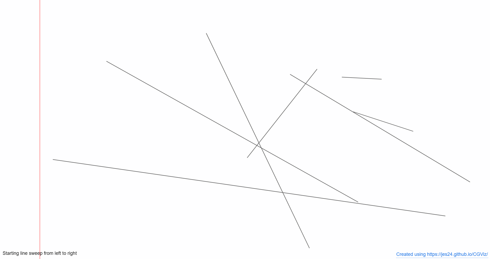

### Area of Rectangle Union (Line Sweep)

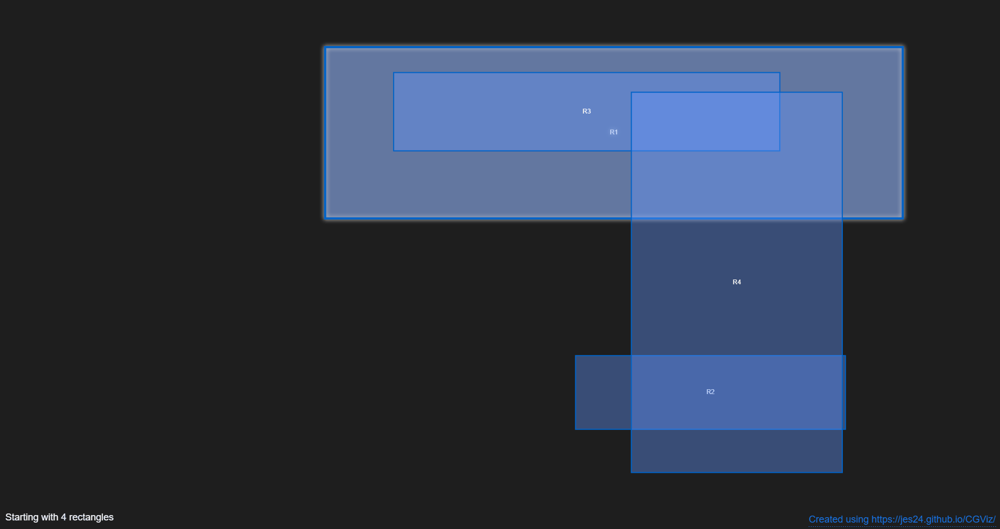

### Area of Rectangle Intersection (Line Sweep)

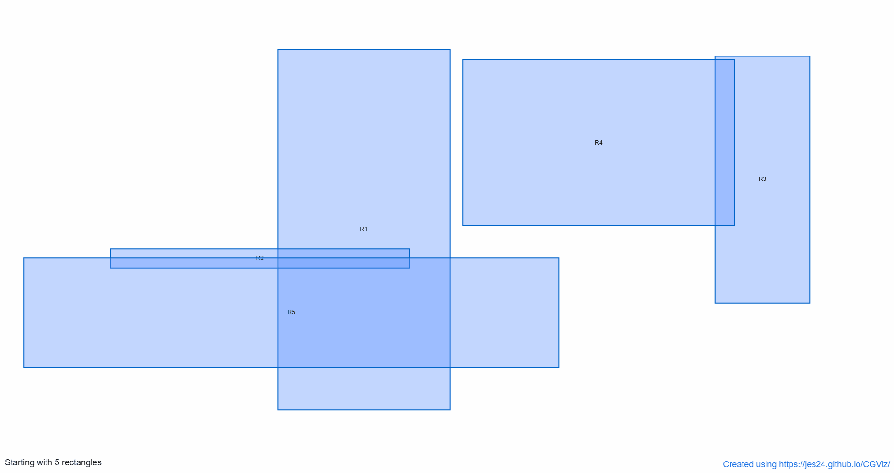

### The Art Gallery Problem

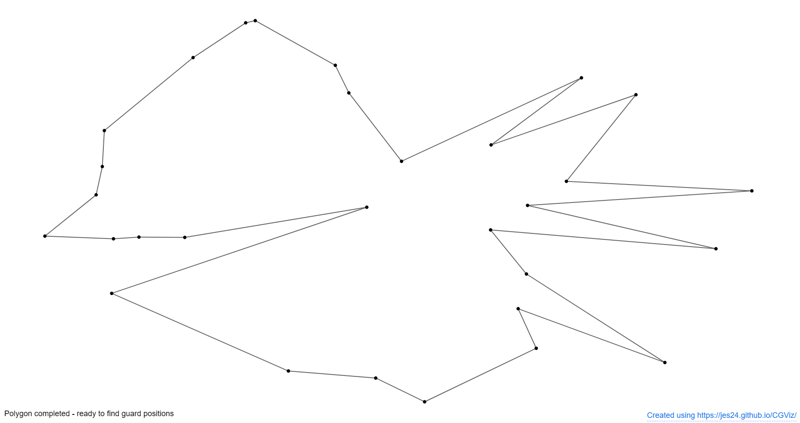

### Convex Hull (Graham Scan)

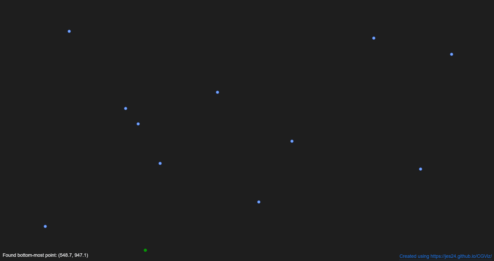

### Convex Hull (Gift Wrap / Jarvis March)

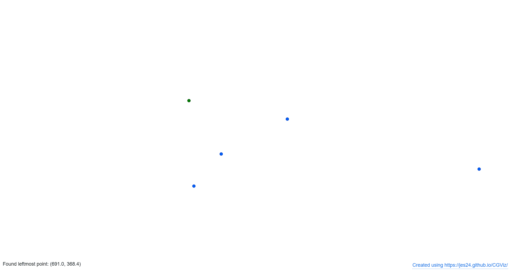

### Convex Hull (QuickHull)

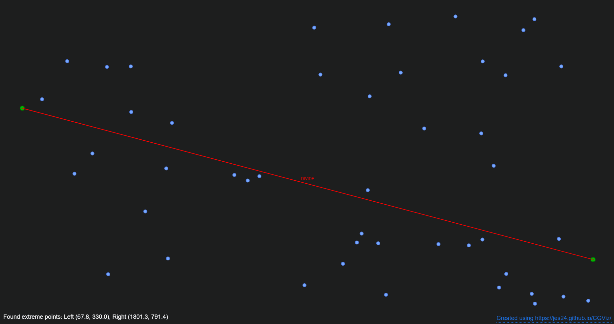

### Polygon Triangulation (Ear Clipping)

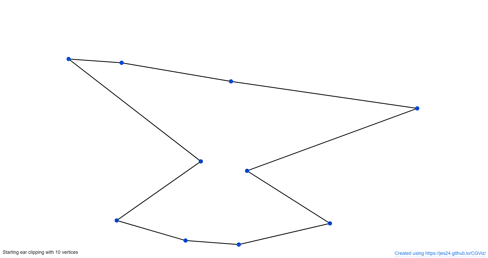

### Delaunay Triangulation (Bowyer-Watson)

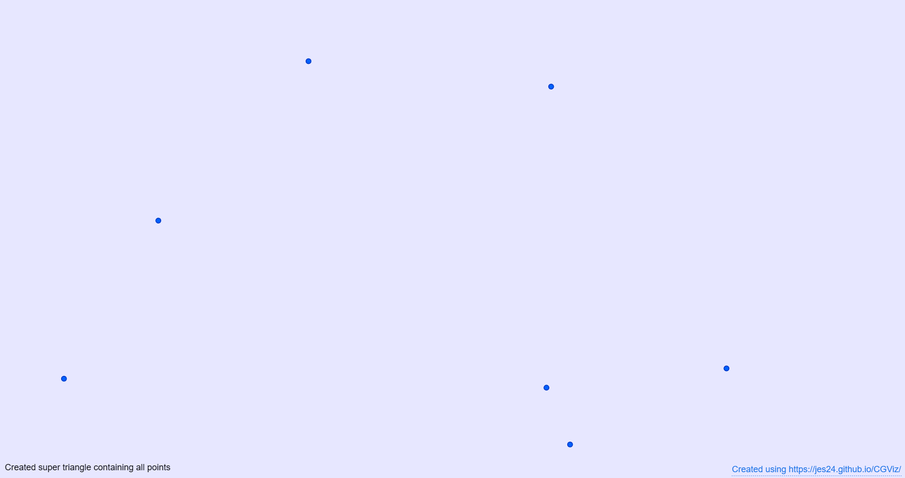

### Voronoi Diagram (via Delaunay dual)

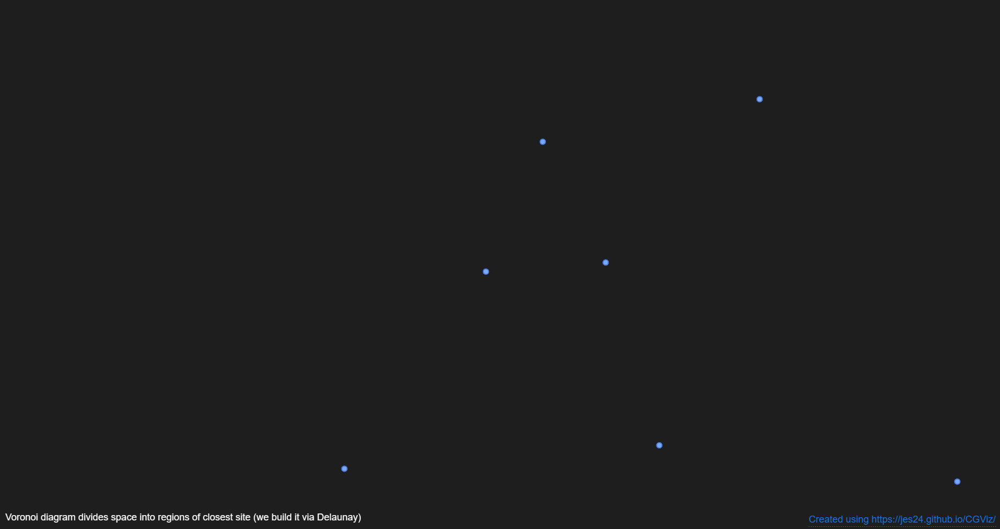

### Voronoi Diagram (Fortune's sweep)

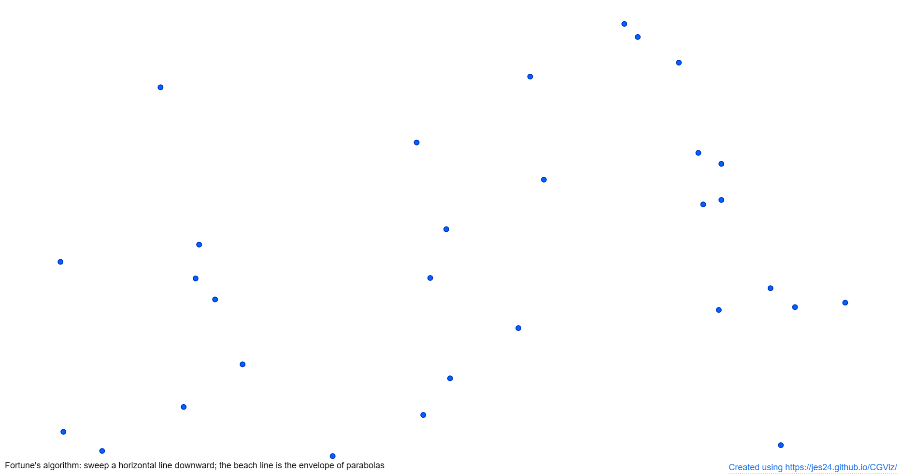

### Point-Line Duality

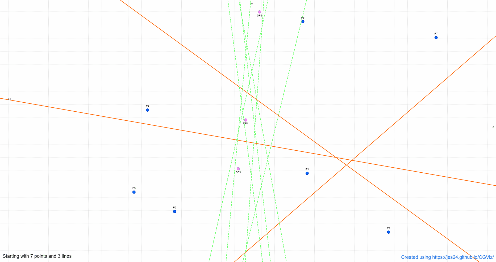

### Interval Tree

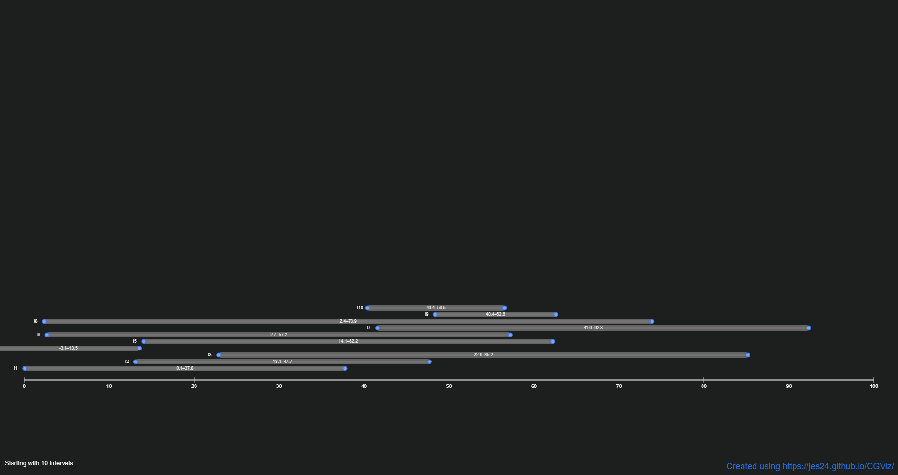

### Segment Tree

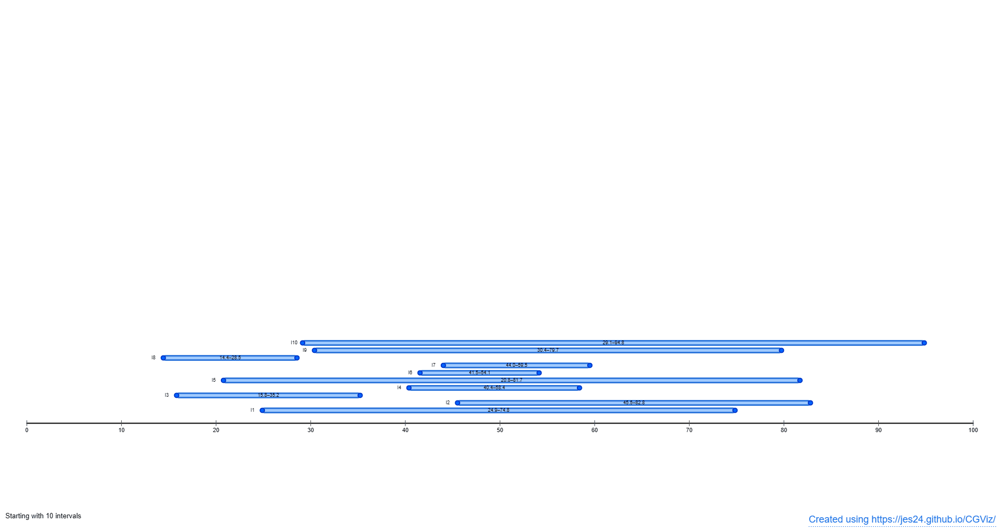

## References

- Main course: NPTEL Computational Geometry playlist taught by Dr. Sandeep Sen and Dr. Pankaj Agrawal - https://www.youtube.com/playlist?list=PLE1010BEDB031C039
- Books:
  - Computational Geometry: Algorithms and Applications (3e) - Mark de Berg, Otfried Cheong, Marc van Kreveld, Mark Overmars
  - Computational Geometry & Computer Graphics in C++ - Michael J. Laszlo

#### Other resources & related visualization tools

- https://github.com/atkirtland/awesome-computational-geometry/ (general resources)
- https://github.com/kasunindikaliyanage/Jyamithika (C++)
- https://students.engineering.wustl.edu/comp_geo_algorithms/index.html
- https://alexbeutel.com/webgl/voronoi.html

## Contributing

Contributions are always welcome! You can explore the [open issues](https://github.com/JeS24/CGViz/issues) for ideas or share your own suggestions. Please read [`CONTRIBUTING.md`](./CONTRIBUTING.md) for the project structure, contribution guidelines and details on how to add a new algorithm.

## Local development / Serving

This is a static HTML/CSS/JS site, but opening `index.html` directly in a browser may not work, as some features require a local HTTP server. Recommended options are below (you may need to install Python or Node.js/npm first):

- Python 3 (built-in HTTP server):

  - From the project root, run:
    - For `bash/zsh` (Linux/macOS) or `PowerShell` (Windows): `python -m http.server 8000`
    - Then open `http://localhost:8000` in your browser.

- npm (http-server):

  - Install once: `npm install -g http-server`
  - Serve: `http-server -c-1` (disables caching) or `http-server -p 8000` to set port.

- VS Code: Live Server extension
  - Install the [Live Server extension](https://marketplace.visualstudio.com/items?itemName=ritwickdey.LiveServer) and click "Go Live" or right-click `index.html` -> "Open with Live Server".

#### Notes:

- Use a modern desktop browser (Firefox, Brave, Edge, Chrome) for best results. Mobile is partially supported, but not fully responsive yet.
- If you run into CORS or file:// issues, use one of the server options above.

## Libraries / Acknowledgements

- [p5.js](https://p5js.org/) (rendering and interaction)
- [jsPDF](https://github.com/parallax/jsPDF) (PDF export)
- [jsgif](https://github.com/antimatter15/jsgif) (GIF export)
- [svg.js](https://svgjs.dev/) (SVG export)
- Icons from [Lucide](https://lucide.dev/icons/)
- "Martian Mono" font from Google Fonts (https://fonts.google.com/specimen/Martian+Mono)
- Favicon generated using [Penrose Tiling Online Generator](https://misc.0o0o.org/penrose/).

## License

This project is released under the [MIT License](./LICENSE). Feel free to use and modify it as you see fit.
